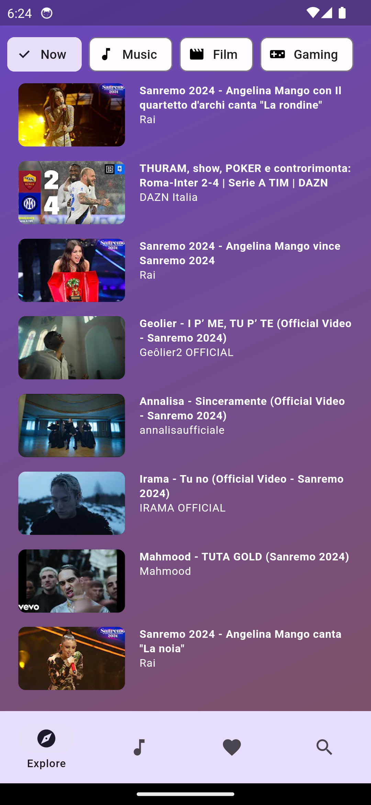
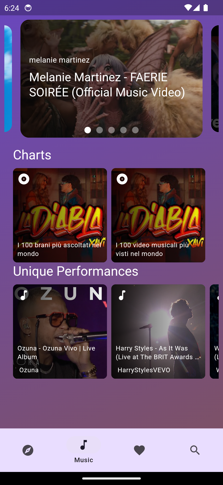
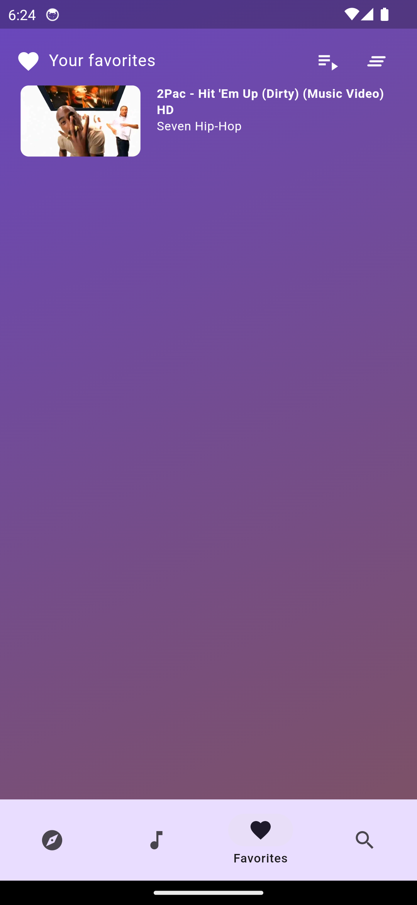
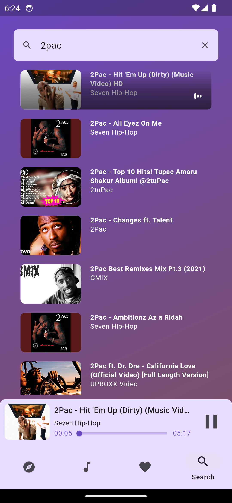
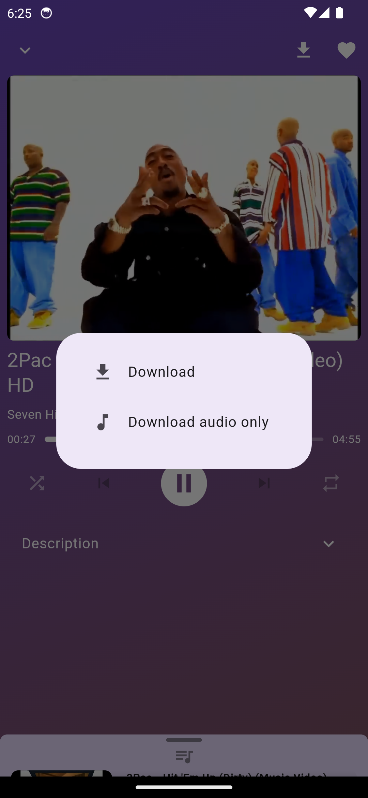
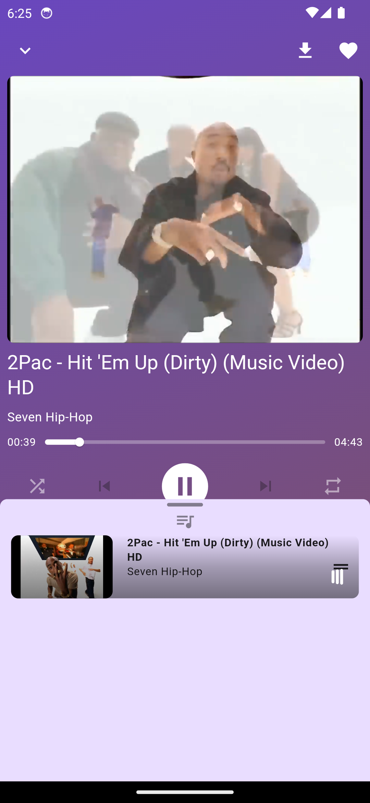

# My Tube

 A Youtube flutter client

## Description

 With this app you can search for videos, channels and playlists. You can also watch videos and save to your local Favorites list.

## Features

- Search for videos, channels and playlists
- Watch videos or listen only audio in the background
- Save videos to your local Favorites list
- Download videos/audios to your local device storage

## Screenshots

### Home

### Music

### Favorites

### Search

### Video Player and Features

## Disclaimer

This app is not affiliated with Youtube. It is a third-party app to access Youtube content.
The author does not endorse or encourage any illegal activity related to downloading or saving copyrighted content.
