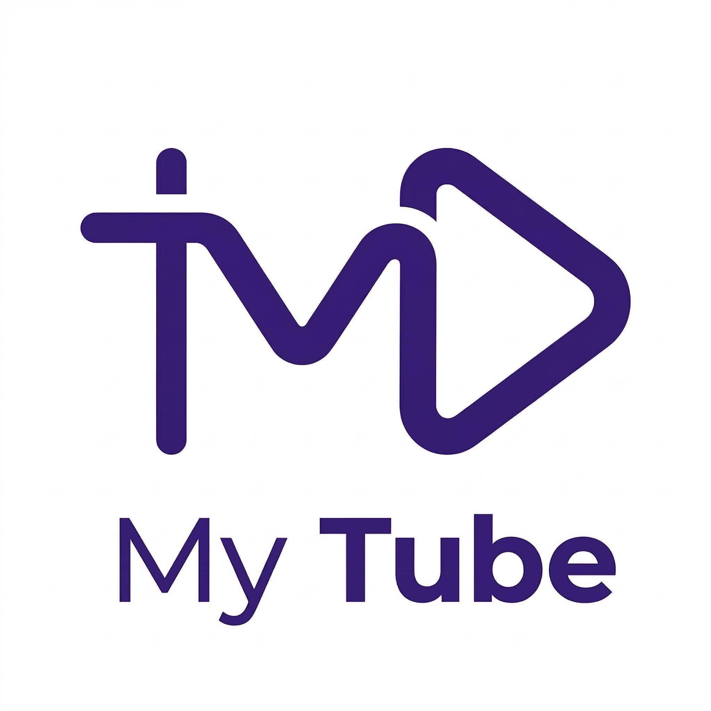

<p align="center">
  
</p>

# My Tube

A powerful, modern YouTube client built with Flutter. My Tube provides a premium streaming experience on mobile and is fully compatible with Android Auto.

## 🚀 Features

### 🔍 Explore & Search
- **Advanced Search**: Find videos, channels, and playlists with ease.
- **Search Suggestions**: Get instant suggestions as you type.
- **Explore Feed**: Discover new content and trending videos.
- **Dedicated Music Section**: A smooth interface for your favorite tracks and music videos.

### 🎧 Premium Playback Experience
- **Background Playback**: Keep listening to your favorite content while using other apps or with the screen off.
- **Continuous Listening**: Intelligent queue management with "Play All" and "Add to Queue" functionality.
- **Global Mini Player**: Control your playback from anywhere in the app with a seamless mini player.
- **Picture-in-Picture (PiP)**: Watch videos while multitasking on your device.

### 🚗 Android Auto Support
- **Full Integration**: Browse and play your favorites directly from your car's dashboard.
- **Driving Optimized**: Simple, safe, and intuitive interface for a better on-the-road experience.
- **Search Support**: Search for content via voice or car keyboard.

### 💾 Offline & Personalization
- **Downloads**: Save videos or audio locally to enjoy them anywhere, anytime.
- **Local Favorites**: Create and manage your own library of favorite content without needing an account.
- **Recently Played**: Easily access your history.
- **Persistent UI**: The app remembers your state and preferences for a consistent experience.

### 🎨 Modern UI/UX
- **Material 3 Design**: Clean and modern interface following the latest design standards.
- **Dynamic Color**: Support for system-wide dynamic themes.
- **Smooth Navigation**: Fast and fluid transitions between views.

## 📦 Download

You can download the latest version of My Tube from the [Releases](https://github.com/gmstyle/my_tube/releases) page.

Alternatively, you can build the APK yourself:

1. Clone the repository:
   ```bash
   git clone https://github.com/gmstyle/my_tube.git
   ```
2. Navigate to the project folder:
   ```bash
   cd my_tube
   ```
3. Get dependencies:
   ```bash
   flutter pub get
   ```
4. Build the APK:
   ```bash
   flutter build apk --release
   ```

## 🛠️ Built With

- **Flutter**: For a beautiful cross-platform experience.
- **BLOC / Cubit**: Robust state management for a responsive UI.
- **Hive**: High-performance local storage for your favorites and settings.
- **Audio Service**: Advanced background audio and Android Auto integration.
- **YouTube Explode**: Efficient and reliable YouTube content fetching.

## ⚖️ Disclaimer

This app is not affiliated with YouTube. It is a third-party application designed to access YouTube content through publicly available interfaces.
The author does not endorse or encourage any illegal activity related to downloading or saving copyrighted content. Please respect the terms of service of the content providers.
